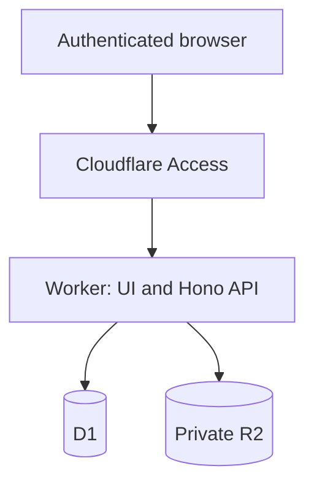

# Architecture

## Runtime

The application is one Cloudflare Worker deployment. React/Vite serves the interface, Hono serves `/api`, D1 stores relational state, and a private R2 bucket stores workbooks and images.

## Security boundary

- Production is fail-closed: `AUTH_MODE` is `access` in `wrangler.jsonc`.
- Every API route except the shallow `/api/health` endpoint validates the `Cf-Access-Jwt-Assertion` signature, issuer, and application audience against the team's rotating JWKS.
- `ALLOWED_EMAILS` can add an application-level email allowlist after JWT validation.
- Unsafe browser requests must have the same `Origin` as the Worker.
- `/api/ready` is authenticated and verifies both D1 and R2 bindings.
- R2 is private; assets are returned only by authenticated application routes.

## Data invariants

- Sample codes and template version numbers are unique in D1.
- Imported template versions and template steps are immutable.
- Assigning a template copies independent run-step state.
- Sample state changes and their history events are emitted by database triggers.
- Dedicated bench records update sample state and append the manual event in one D1 batch, guarded by the caller's last-seen timestamp and a per-mutation identifier.
- Step state, notes, optional attachment event, sample timestamp, and run rollup are one D1 batch.
- Every user-originated record stores the validated Access email.
- Ordinary R2 uploads are registered in `assets`; failed registration removes the object.
- FabuBlox database rows are committed in one transactional D1 batch. A failed batch removes every R2 object uploaded for that import and leaves a failed import audit row.

## Platform limits

Bulk inserts keep each statement below D1's 100-bound-parameter limit. A confirmed import is capped at 180 steps and 40 images, uses at most five concurrent R2 writes, and keeps the D1 batch below the Free plan's 50-query invocation limit.

Full export reads all tables through one D1 batch for a consistent database snapshot, then downloads the referenced private assets into a browser-generated ZIP. The manifest contains stable relative paths and no authentication URLs.
