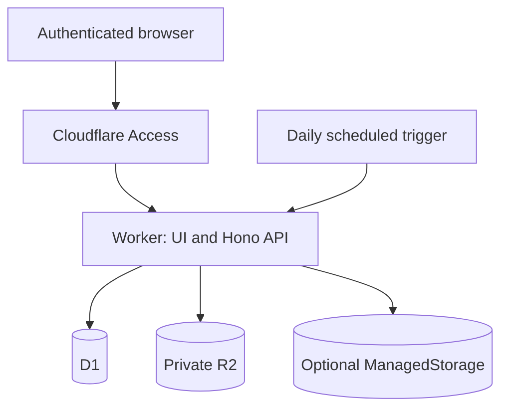

# Architecture

## Runtime

The application is one Cloudflare Worker deployment. React/Vite serves the interface, Hono serves `/api`, D1 stores relational state, a private R2 bucket stores workbooks and images, and an optional `ManagedStorage` adapter stores unchanged original files.

```mermaid
flowchart TD
  U[Authenticated browser] --> A[Cloudflare Access]
  A --> W[Worker: UI and Hono API]
  C[Daily scheduled trigger] --> W
  W --> D[(D1)]
  W --> R[(Private R2)]
  W --> M[(Optional ManagedStorage)]
```

The first blob-lifecycle implementation remains inside this Worker. It does not require Queues, Workflows, Durable Objects, Containers, or a second Worker.

## Security boundary

- Production is fail-closed: `AUTH_MODE=access` is a Cloudflare Runtime Variable. Account-specific runtime values are preserved across Wrangler deployments and are never committed to the repository.
- Every API route except the shallow `/api/health` endpoint validates the `Cf-Access-Jwt-Assertion` signature, issuer, and application audience against the team's rotating JWKS.
- `ALLOWED_EMAILS` can add an application-level email allowlist after JWT validation.
- Unsafe browser requests must have the same `Origin` as the Worker.
- `/api/ready` is authenticated and verifies both D1 and R2 bindings; configured managed storage is checked separately.
- R2 is private; assets are returned only by authenticated application routes.
- Managed-storage credentials remain server-side and are never returned in export manifests or warnings.

## Data invariants

- Sample codes and template version numbers are unique in D1.
- Stable Sample, Run, Run-step, canonical Comment, attachment occurrence, execution-image occurrence, metrology-reference, and Template identities use soft-delete/restore semantics. Accidental physical deletion of the protected source tables is rejected by database triggers.
- A process-template family owns immutable versions. A version is editable only before its first run-plan reference; the first reference atomically locks it.
- An unused template version can be moved to trash. Once a version has a run-plan or historical reference it can only be hidden/archived, preserving every historical link while removing it from future assignment choices.
- Metrology templates are flat, directly editable presets. A run entry stores the selected step-definition hash as its immutable snapshot, so edits in either direction never propagate between the template and an existing record.
- Metrology template equipment/method notes and reference files are template-only. They are intentionally excluded from run snapshots and run views.
- Step definitions and expected diagram states are content-addressed. Process-template versions, plans, and runs reference their hashes, so repeated content is stored once.
- A physical sample has at most one active process run, while metrology can run independently or sit between fabrication steps. Starting, completing, or editing metrology never changes sample status or current structure and never contributes to fabrication progress.
- Starting or reopening a process run makes the sample `active`; completing it returns an `active` sample to `stored`. Explicit physical states such as `consumed` or `lost` are never overwritten by run completion.
- Finished runs form an ordered predecessor chain; a new run anchors to the previous run's last actual step.
- Every run stores an immutable initial substrate hash confirmed when it begins. Before a new run starts, the server revalidates the displayed template and current-sample structure choices.
- Split children store the parent's current structure as an inherited substrate snapshot. Their first run requires the same confirmation when that structure differs from the selected template.
- Each run has immutable plan revisions. A newer version of the same process-template family becomes authoritative for the current plan's order, definitions, imported notes, and expected diagrams. Matched rows retain their execution status and user-entered evidence, ad-hoc execution remains in the chain, and newly inserted work behind the execution boundary is linked as skipped.
- Version alignment matches normalized step names independently of order. Repeated names prefer unchanged definitions, then stable logical keys, then occurrence order. Step numbers do not define cross-version identity.
- Run rows store actual overrides only when they differ from the hashed process-step definition. Comments, deviation reasons, execution diagrams, and ad-hoc steps remain sample-specific.
- State verification is a sparse fabrication-only chain. It ignores metrology records, snapshots the fabrication steps covered since the previous valid verification, and records the matched or mismatched outcome.
- Sample state changes and their history events are emitted by database triggers.
- Dedicated bench records update sample state and append the manual event in one D1 batch, guarded by the caller's last-seen timestamp and a per-mutation identifier.
- Processing reads omit the permanent Timeline and parent/child archive data; the Sample page uses the full archive view.
- Step state, notes, optional attachment event, sample timestamp, and run rollup are one D1 batch.
- Every user-originated record stores the validated Access email.

## Blob lifecycle invariants

- Sources and occurrences own meaning. `assets` and `managed_storage_objects` own physical-byte metadata and deduplication.
- `blob_retention_edges` is the shared definition used by Cancel, scheduled cleanup, export mapping, and future permanent-delete planning.
- Soft deletion and archival do not remove durable retention edges. Unfinished/retryable submissions retain already-registered bytes until retryability is explicitly closed.
- Sample-record primary images and distinct `events.metadata_json.thumbnailKey` images are separate retention edges.
- `assets.status` expresses upload/registration readiness. `blob_gc_ledger` expresses cross-provider cleanup work; they are not interchangeable.
- GC uses `orphaned -> deleting -> deleted` with a unique operation ID. Edge creation clears only an unclaimed orphan and rejects `deleting` or `deleted` locators.
- Cancel does not delete provider bytes. The daily scheduled handler is the ordinary physical-cleanup entry point.
- A `deleted` locator is terminal and must not be silently reused for different bytes. Recovery registers a new locator.
- Ready R2 content is unique among live locators. Historical metadata for a collected locator remains, and the same content may be registered again at a new live locator after the old locator reaches `deleting` or `deleted`.
- A legacy pre-blob-lifecycle migration rewires unfinished Comment items away from an orphaned managed object when an already-ready content-identical winner exists. This prevents the old partial uniqueness rule from blocking migration 0016.
- Provider absence is an integrity condition, not permission to remove source or occurrence rows.

## Export invariants

- Full export reads all table/view snapshots through one D1 batch and keeps every active, archived, failed, cancelled, and soft-deleted database row.
- Physical blobs are deduplicated by provider locator and downloaded at most once.
- Final outcomes include packaged, missing, provider unavailable, metadata not ready, download failed, size mismatch, and hash mismatch.
- One failed blob does not abort unrelated entries. The final ZIP always contains `export-manifest.json` and `export-warnings.json` when browser ZIP creation itself succeeds.
- Export download URLs are authenticated application routes and are not written into the final archive.

## Platform limits

- Bulk inserts keep each statement below D1's 100-bound-parameter limit.
- A confirmed import is capped at 180 steps and 180 images, uses at most five concurrent R2 writes, and divides persistence into bounded batches behind the pending-import visibility gate.
- Scheduled blob cleanup uses bounded discovery/deletion batches; a large backlog may require repeated daily runs rather than one unbounded execution.
- Full export downloads blobs sequentially but builds the ZIP in browser memory with JSZip. Missing blobs are non-fatal, but a sufficiently large valid archive can still exceed browser memory or Blob limits. A streaming/server-side or desktop export path is a later scalability slice.
- The first deduplication implementation checks metadata and GC claim state but does not perform provider `HEAD`/`stat` before every reuse. Missing-provider self-healing is deferred to storage-integrity maintenance.

See [the blob lifecycle contract](./BLOB_LIFECYCLE_CONTRACT.md) for normative rules and [blob lifecycle activation and operations](./BLOB_LIFECYCLE_OPERATIONS.md) for the deployment gate, monitoring queries, incident handling, and explicit deferrals.
